# Burabeeh workflow

Complete illustrated guide to the selected MiniMax H3 ComfyUI workflow: **36 node close-ups, seven run screens, and a 14-minute narrated video**. Read everything here, then download the workflow to follow along.

## Watch the full tutorial

https://github.com/user-attachments/assets/7aaa8dbc-8290-4dcb-ad21-aec3b75ccbe1

[Download the complete 14:14 video](Burabeeh-workflow-tutorial.mp4?raw=true) · [Video chapter timings](VIDEO-CHAPTERS.md)

The video uses real ComfyUI captures, zoom transitions, readable held close-ups and synthesized narration. It shows a fresh preview and refinement run; rendering waits are edited out.

## Contents

- [Setup and model files](#setup-and-model-files)
- [Model download links](#model-download-links)
- [Quick start](#quick-start)
- [Tested settings](#tested-settings)
- [How the two stages work](#how-the-two-stages-work)
- [Node index](#node-index)
- [Every node](#every-node)
- [Screen-by-screen run demonstration](#screen-by-screen-run-demonstration)
- [Troubleshooting and review](#troubleshooting-and-review)
- [Downloads and backup](#downloads-and-backup)

## Setup and model files

This configuration was tested on Windows with an NVIDIA RTX 3090 (24 GB). Use a ComfyUI build with the H3 core nodes and comfy kitchen attention, plus the H3 latent upscaler extension. The exact tested versions and source links are in [MODEL-NOTES.md](MODEL-NOTES.md) and [ENVIRONMENT.json](ENVIRONMENT.json).

1. Download [Burabeeh workflow.json](Burabeeh%20workflow.json?raw=true). Open the downloaded JSON through ComfyUI's workflow menu or drag it onto the canvas.
2. Install the [H3 latent upscaler custom node](https://github.com/LBH-123-AI/Comfyui_Minimax_h3_latent_Upscaler) and its requirements in the Python environment used by ComfyUI. The recorded working revision is in the model notes. Restart ComfyUI after installation.
3. Put the six model files below under your ComfyUI `models` directory, or the corresponding configured extra model path. Use the [source links and conversion instructions](MODEL-NOTES.md) and [exact manifest](MODEL-MANIFEST.json).
4. Select the matching weights in nodes 1, 6, 7, 8, 9 and 40. Keep nodes 3–5 bypassed. These optional placeholders do not require downloads.
5. Upload your own image into node 100. The example source image is not bundled. Write a matching scene in node 10 before running.

| Purpose | Path below `models/` | Node |
|---|---|---|
| Hybrid INT8 base | `diffusion_models/minimax_h3_hybrid_fl2va_ref2va_b25-49-int8.safetensors` | 1 |
| Compatible Turbo adapter | `loras/lightx2v_hybrid-4to8step-Turbo_r48_b25_curve_compatible.safetensors` | 6 |
| Qwen text encoder | `text_encoders/MiniMax/qwen3vl_32b_minimax_h3_nvfp4_awq.safetensors` | 7 |
| Video VAE | `vae/Minimax/minimax_h3_video_vae_fp16.safetensors` | 8 |
| Audio VAE | `vae/Minimax/minimax_h3_audio_vae_fp32.safetensors` | 9 |
| Latent upscaler | `latent_upscale_models/minimax_h3_latent_upscaler_3d_bf16.safetensors` | 40 |

**Turbo compatibility matters:** the compatible file is a local conversion. Renaming the original upstream adapter does not perform that conversion. The unadapted adapter caused a shape mismatch with this base. Follow the reproduction instructions in [MODEL-NOTES.md](MODEL-NOTES.md). Model weights are not included in this repository.

A locally tested MiniMax H3 workflow for a fast preview followed by latent refinement, with the original preview audio reused in the final video. This is the owner’s selected working configuration, not a benchmark proving it is the best workflow for every machine or subject.

## Model download links

These links select the exact upstream variants used by this configuration. Save each file in the folder shown above. Links are pinned to specific publisher revisions.

| Model | Node | Links |
|---|---|---|
| Hybrid INT8 base | 1 | [Download](https://huggingface.co/smhfacct/Minimax-H3-fl2va-ref2va-hybrid-models/resolve/a36feb17fbd1f20ff4bdd509ccd07e2b7b585a38/minimax_h3_hybrid_fl2va_ref2va_b25-49-int8.safetensors?download=true) · [File page](https://huggingface.co/smhfacct/Minimax-H3-fl2va-ref2va-hybrid-models/blob/a36feb17fbd1f20ff4bdd509ccd07e2b7b585a38/minimax_h3_hybrid_fl2va_ref2va_b25-49-int8.safetensors) |
| Turbo source adapter — convert before use | 6 | [Download](https://huggingface.co/TenStrip/MinimaxH3-Turbo_Shenanigans/resolve/7b0cb70261a47dfb7b660999a0545163f20a8d14/lightx2v_hybrid-4to8step-Turbo_r48.safetensors?download=true) · [File page](https://huggingface.co/TenStrip/MinimaxH3-Turbo_Shenanigans/blob/7b0cb70261a47dfb7b660999a0545163f20a8d14/lightx2v_hybrid-4to8step-Turbo_r48.safetensors) |
| Qwen text encoder | 7 | [Download](https://huggingface.co/Comfy-Org/MiniMax-H3/resolve/7e75982b97cd5a41d2dcfa1904ee88d0686d6fd1/text_encoders/qwen3vl_32b_minimax_h3_nvfp4_awq.safetensors?download=true) · [File page](https://huggingface.co/Comfy-Org/MiniMax-H3/blob/7e75982b97cd5a41d2dcfa1904ee88d0686d6fd1/text_encoders/qwen3vl_32b_minimax_h3_nvfp4_awq.safetensors) |
| Video VAE FP16 | 8 | [Download](https://huggingface.co/Comfy-Org/MiniMax-H3/resolve/7e75982b97cd5a41d2dcfa1904ee88d0686d6fd1/vae/minimax_h3_video_vae_fp16.safetensors?download=true) · [File page](https://huggingface.co/Comfy-Org/MiniMax-H3/blob/7e75982b97cd5a41d2dcfa1904ee88d0686d6fd1/vae/minimax_h3_video_vae_fp16.safetensors) |
| Audio VAE FP32 | 9 | [Download](https://huggingface.co/Comfy-Org/MiniMax-H3/resolve/7e75982b97cd5a41d2dcfa1904ee88d0686d6fd1/vae/minimax_h3_audio_vae_fp32.safetensors?download=true) · [File page](https://huggingface.co/Comfy-Org/MiniMax-H3/blob/7e75982b97cd5a41d2dcfa1904ee88d0686d6fd1/vae/minimax_h3_audio_vae_fp32.safetensors) |
| Latent upscaler BF16 | 40 | [Download](https://huggingface.co/LBH-123-AI/Minimax_h3_latent_Upscaler/resolve/3f941d5d182014dd5c0a5e16330420ee2d4aa0c6/minimax_h3_latent_upscaler_3d_conv_v1/minimax_h3_latent_upscaler_3d_conv_v1_bf16.safetensors?download=true) · [File page](https://huggingface.co/LBH-123-AI/Minimax_h3_latent_Upscaler/blob/3f941d5d182014dd5c0a5e16330420ee2d4aa0c6/minimax_h3_latent_upscaler_3d_conv_v1/minimax_h3_latent_upscaler_3d_conv_v1_bf16.safetensors) |

**Turbo adapter (node 6):** download the source adapter above, then follow the [conversion instructions](MODEL-NOTES.md#critical-turbo-compatibility-caveat) using [adapt_turbo.py](adapt_turbo.py) and the [pinned conversion helper](https://github.com/Jalen-Brunson/ComfyUI-MiniMax-H3-PDD-Acc/tree/311a65dd53832d8a5f8177a9d5fb923c09e35a90). The workflow requires the resulting `lightx2v_hybrid-4to8step-Turbo_r48_b25_curve_compatible.safetensors`; it has no direct upstream download. Merely renaming the source adapter will not work.

**Upscaler (node 40):** the publisher calls this file `minimax_h3_latent_upscaler_3d_conv_v1_bf16.safetensors`. Save it as `minimax_h3_latent_upscaler_3d_bf16.safetensors` in `models/latent_upscale_models/` to match this workflow. Its SHA-256 matches the installed file: `4f57821f5837f32f7142b67d815606dbd7550f194e5c769f7d6c3f83b146a5e6`. This is a filename change only, unlike the Turbo conversion.

**Optional nodes 3–5 are bypassed:** their placeholder adapters are not used and are not required downloads. The six entries above cover all model weights used by the active workflow.

## Quick start

1. Install a compatible ComfyUI build and the H3 latent upscaler custom node. See the model and environment notes.
2. Put the six required model files in their documented folders. The exact locally adapted Turbo weight is required.
3. Open `Burabeeh workflow.json` in ComfyUI.
4. At node 100, upload your own reference. The saved example filename is `ep01_end_frame.png`; this personal project image is not bundled in the public backup.
5. Replace node 10’s example prompt for your own scene. Match identity, costume AND location to the reference.
6. Select node 48 and press **Ctrl+M** to mute final saving for a preview-only run. Check that its mode visibly changes. Do not bypass Save Video.
7. Click **Run** once. Wait for completion, then play the preview with sound.
8. Keep seed, models, prompt and reference unchanged. Select node 48 and press **Ctrl+M** again to enable it, then Run for refinement. Cache reuse is conditional; restarting or changing upstream inputs may regenerate the preview.
9. Find videos under `output/Burabeeh-workflow/`. Review the refined result with sound before using it.

**Default behavior:** both Save Video nodes are enabled, so a normal Run computes preview AND refinement. The graph itself has no automatic human-review pause.

## Tested settings

| Setting | Value |
|---|---|
| Preview | 864 × 480 |
| Length / playback | 158 frames / 24 fps, approximately 6.58 s |
| Preview sampling | res_multistep / simple / 8 steps / denoise 1.0 |
| Compatible Turbo strength | 0.70 |
| Final | 1376 × 768 |
| Refinement | 4 steps / simple / denoise 0.25 |
| Video tiled decode | 512 / 64 overlap / temporal 32 / temporal overlap 8 |
| Optional adapter nodes 3–5 | Bypassed; no optional weights required |

## How the two stages work

The reference image and prompt enter node 20 with the text encoder and two VAEs. Node 20 creates conditioning and an initial combined audio/video latent. The eight-step preview sampler turns this into generated latents. Nodes 26–30 separate, decode and save the preview with sound.

For refinement, node 40 enlarges the preview's visual latent. Node 41 joins that enlarged visual latent to the original audio latent. The four-step sampler refines it, and node 46 decodes the improved picture. Node 47 deliberately pairs that picture with **the original decoded audio from node 28**. This is how the final file preserves the preview's sound.

**A node is one operation; a wire passes its output into the next operation.** A latent is a compressed model representation, not an ordinary MP4. These refinement nodes operate on latents still available to ComfyUI. They do not load a previously saved preview MP4.

**For everyday use:** change the reference (100), prompt (10), seed (21), and only then dimensions or duration if needed (11–15). Keep the model, sampler and decode settings at the tested values until a first run succeeds. A fixed seed helps comparison, but changing the prompt or reference can still change the result substantially.

**Match place as well as face.** If the character is at Baker Street, the reference and prompt should show Baker Street. For a crime scene, prepare a coherent reference of the same character at that crime scene. Refinement improves the existing take; it is not a reliable way to correct the wrong setting or incorrect dialogue.

## Node index

- [Node 1 — Hybrid b25-49 — tutorial base](#1-hybrid-b25-49--tutorial-base)
- [Node 2 — Attention backend](#2-attention-backend)
- [Node 3 — Optional correction — BYPASSED](#3-optional-correction--bypassed)
- [Node 4 — Optional Cinema / close shots — BYPASSED](#4-optional-cinema--close-shots--bypassed)
- [Node 5 — Optional Film / wide shots — BYPASSED](#5-optional-film--wide-shots--bypassed)
- [Node 6 — Hybrid Turbo — locally curve-adapted — 0.70](#6-hybrid-turbo--locally-curve-adapted--070)
- [Node 7 — H3 text encoder](#7-h3-text-encoder)
- [Node 8 — Video VAE — installed FP16](#8-video-vae--installed-fp16)
- [Node 9 — Audio VAE](#9-audio-vae)
- [Node 10 — 1. EDIT YOUR PROMPT](#10-1-edit-your-prompt)
- [Node 11 — Preview width](#11-preview-width)
- [Node 12 — Preview height](#12-preview-height)
- [Node 13 — 158 frames — 6.58 seconds at 24 fps](#13-158-frames--658-seconds-at-24-fps)
- [Node 14 — Final width — change with final height](#14-final-width--change-with-final-height)
- [Node 15 — Final height](#15-final-height)
- [Node 20 — Reference-guided H3 — Episode 1 image CONNECTED](#20-reference-guided-h3--episode-1-image-connected)
- [Node 21 — KEEP FIXED after choosing a preview](#21-keep-fixed-after-choosing-a-preview)
- [Node 22 — Preview guidance](#22-preview-guidance)
- [Node 23 — Sampler — tutorial res_multistep](#23-sampler--tutorial-res_multistep)
- [Node 24 — 8-step preview / full denoise](#24-8-step-preview--full-denoise)
- [Node 25 — 3. GENERATE PREVIEW](#25-3-generate-preview)
- [Node 26 — Separate picture and sound](#26-separate-picture-and-sound)
- [Node 27 — Preview picture — tiled decode](#27-preview-picture--tiled-decode)
- [Node 28 — Preview sound — reused for final output](#28-preview-sound--reused-for-final-output)
- [Node 29 — Preview with original audio](#29-preview-with-original-audio)
- [Node 30 — PREVIEW — review motion + sound first](#30-preview--review-motion--sound-first)
- [Node 40 — 4. Upscale VIDEO latent only](#40-4-upscale-video-latent-only)
- [Node 41 — Rejoin untouched audio latent](#41-rejoin-untouched-audio-latent)
- [Node 42 — Refinement guidance — same prompt/references](#42-refinement-guidance--same-promptreferences)
- [Node 43 — 4-step refinement / denoise 0.25](#43-4-step-refinement--denoise-025)
- [Node 44 — 5. REFINE THE SELECTED PREVIEW](#44-5-refine-the-selected-preview)
- [Node 45 — Refined video latent](#45-refined-video-latent)
- [Node 46 — Final picture — tiled decode](#46-final-picture--tiled-decode)
- [Node 47 — Final picture + stage-one audio](#47-final-picture--stage-one-audio)
- [Node 48 — FINAL — refinement output (enabled)](#48-final--refinement-output-enabled)
- [Node 100 — ENABLED — Sherlock identity + Episode 1 end frame](#100-enabled--sherlock-identity--episode-1-end-frame)

## Every node

### 1. Hybrid b25-49 — tutorial base

**Type:** `UNETLoader`. **Mode:** active.

Loads the MiniMax H3 hybrid b25 to 49 INT8 diffusion model. Keep weight dtype on default. This is the tested base; similarly named pruned reference or first-last-frame models are not interchangeable with this setup.

**Connections and saved settings**

| Item | Value or source |
|---|---|
| Setting `unet_name` | `minimax_h3_hybrid_fl2va_ref2va_b25-49-int8.safetensors` |
| Setting `weight_dtype` | `default` |

**Feeds:** **2** (ModelAttentionBackend).

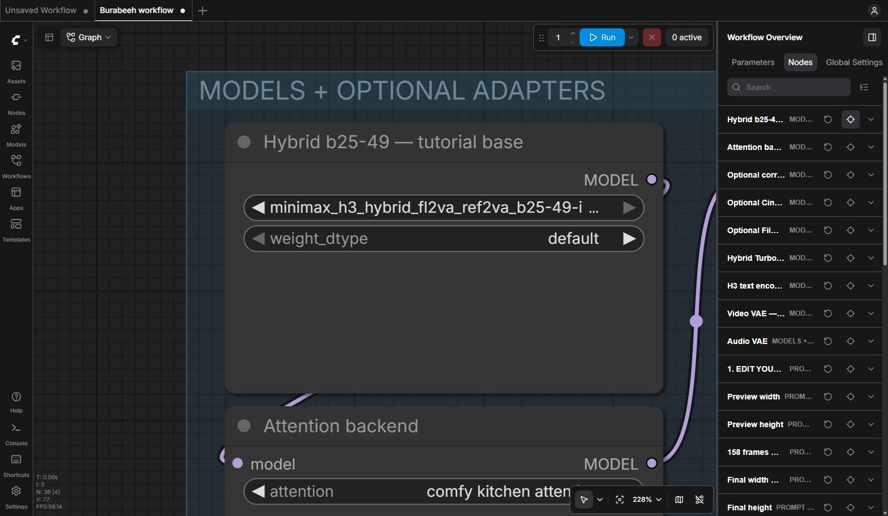

[Back to node index](#node-index)

### 2. Attention backend

**Type:** `ModelAttentionBackend`. **Mode:** active.

Selects comfy kitchen attention for the loaded model. Keep this tested attention backend when reproducing the local setup. This node changes attention computation, not the story, reference image or video length.

**Connections and saved settings**

| Item | Value or source |
|---|---|
| Input `model` | Node **1**, `MODEL` output |
| Setting `attention` | `comfy kitchen attention` |

**Feeds:** **3** (LoraLoaderModelOnly).

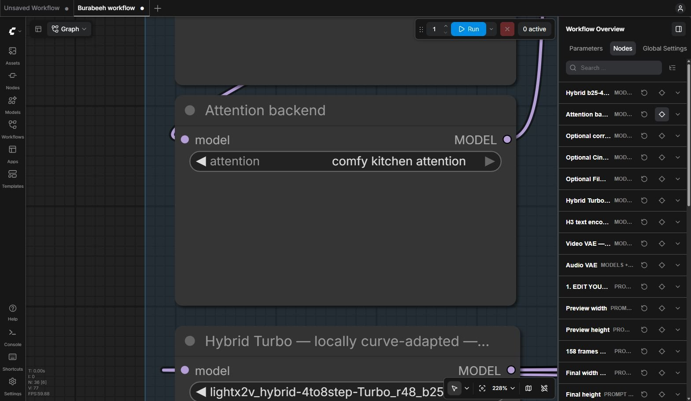

[Back to node index](#node-index)

### 3. Optional correction — BYPASSED

**Type:** `LoraLoaderModelOnly`. **Mode:** bypassed.

This optional correction adapter is bypassed. It passes the model through without loading the named weight. The file is not required. Leave it bypassed; enabling an unavailable adapter causes a missing-model error.

**Connections and saved settings**

| Item | Value or source |
|---|---|
| Input `model` | Node **2**, `MODEL` output |

**Feeds:** **4** (LoraLoaderModelOnly).

**Keep bypassed:** the saved strength and placeholder filename are inactive. This node passes the model through to the next adapter slot.

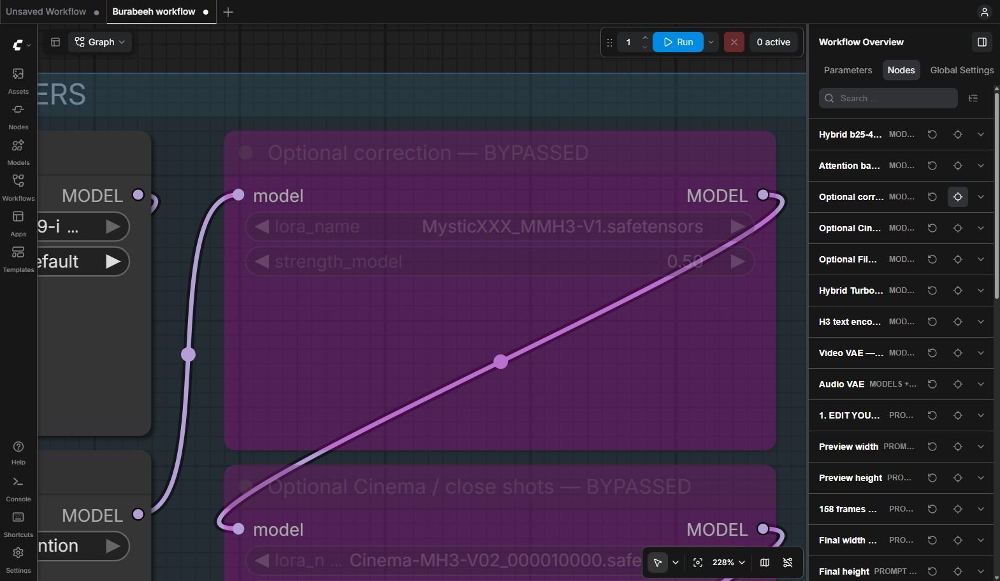

[Back to node index](#node-index)

### 4. Optional Cinema / close shots — BYPASSED

**Type:** `LoraLoaderModelOnly`. **Mode:** bypassed.

This optional cinema adapter is also bypassed. Its strength value has no effect while bypassed. It is not part of the tested six-model configuration and is not needed to generate a preview or refined output.

**Connections and saved settings**

| Item | Value or source |
|---|---|
| Input `model` | Node **3**, `MODEL` output |

**Feeds:** **5** (LoraLoaderModelOnly).

**Keep bypassed:** the saved strength and placeholder filename are inactive. This node passes the model through to the next adapter slot.

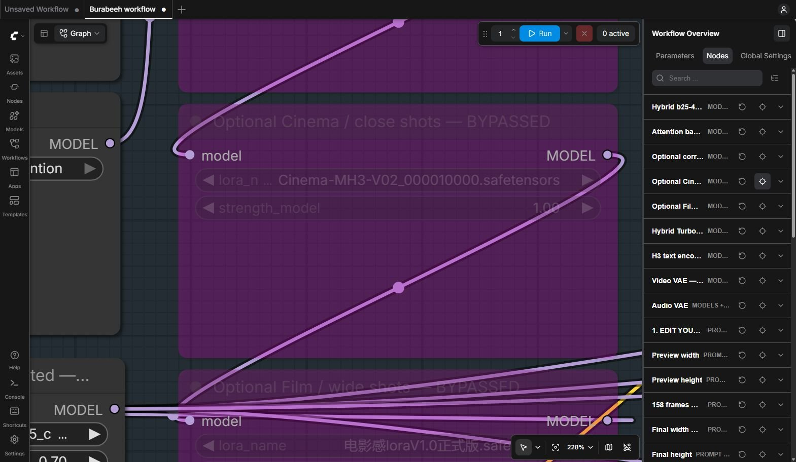

[Back to node index](#node-index)

### 5. Optional Film / wide shots — BYPASSED

**Type:** `LoraLoaderModelOnly`. **Mode:** bypassed.

The optional film adapter is bypassed too. Do not mistake the placeholder filename for a required download. Nodes three, four and five are reserved optional slots, not evidence that these adapters have been tested.

**Connections and saved settings**

| Item | Value or source |
|---|---|
| Input `model` | Node **4**, `MODEL` output |

**Feeds:** **6** (LoraLoaderModelOnly).

**Keep bypassed:** the saved strength and placeholder filename are inactive. This node passes the model through to the next adapter slot.

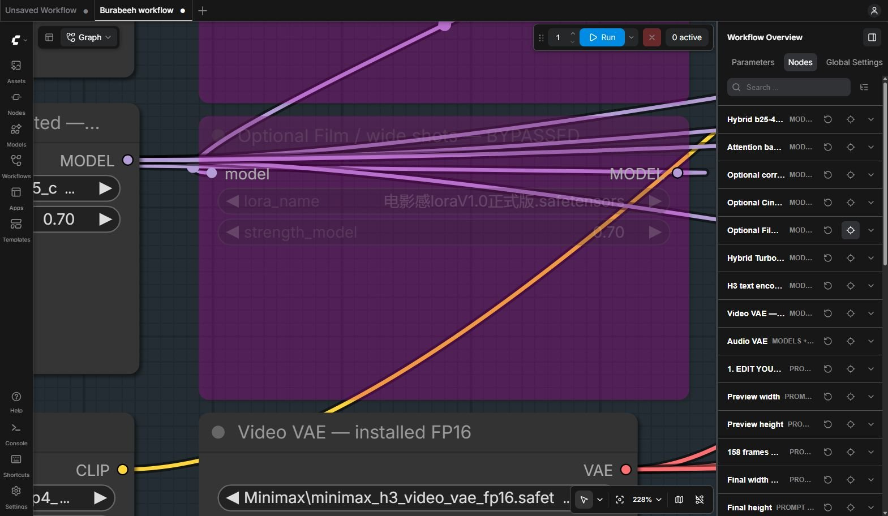

[Back to node index](#node-index)

### 6. Hybrid Turbo — locally curve-adapted — 0.70

**Type:** `LoraLoaderModelOnly`. **Mode:** active.

Loads the locally curve-adapted Hybrid Turbo adapter at strength zero point seven. Use the exact compatible filename. The original unadapted adapter caused a shape mismatch. This conversion is specific to the hybrid base and is documented in the model notes.

**Connections and saved settings**

| Item | Value or source |
|---|---|
| Input `model` | Node **5**, `MODEL` output |
| Setting `lora_name` | `lightx2v_hybrid-4to8step-Turbo_r48_b25_curve_compatible.safetensors` |
| Setting `strength_model` | `0.7` |

**Feeds:** **22** (BasicGuider), **24** (BasicScheduler), **42** (BasicGuider), **43** (BasicScheduler).

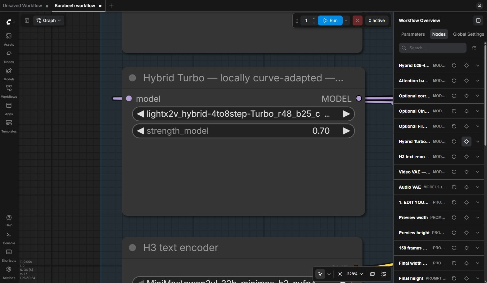

[Back to node index](#node-index)

### 7. H3 text encoder

**Type:** `CLIPLoader`. **Mode:** active.

Loads the MiniMax Qwen three vision-language text encoder, with type minimax and device default. It interprets the prompt and reference inputs. Keep it in the text encoders MiniMax folder and retain its exact filename.

**Connections and saved settings**

| Item | Value or source |
|---|---|
| Setting `clip_name` | `MiniMax\qwen3vl_32b_minimax_h3_nvfp4_awq.safetensors` |
| Setting `type` | `minimax` |
| Setting `device` | `default` |

**Feeds:** **20** (MiniMaxH3ReferenceToVideo).

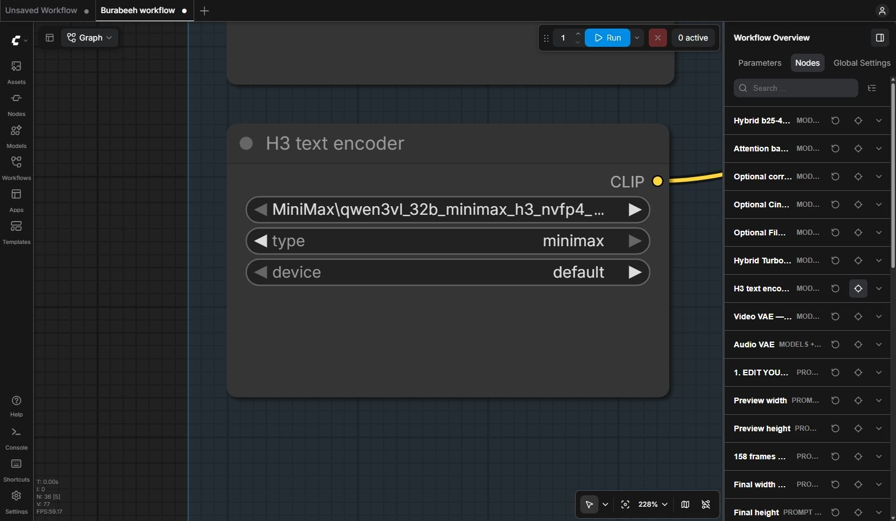

[Back to node index](#node-index)

### 8. Video VAE — installed FP16

**Type:** `VAELoader`. **Mode:** active.

Loads the H3 video VAE in FP16. The VAE converts between image pixels and the compressed visual representation used by the model. Both preview and final video decoding use this video VAE.

**Connections and saved settings**

| Item | Value or source |
|---|---|
| Setting `vae_name` | `Minimax\minimax_h3_video_vae_fp16.safetensors` |

**Feeds:** **20** (MiniMaxH3ReferenceToVideo), **27** (VAEDecodeTiled), **46** (VAEDecodeTiled).

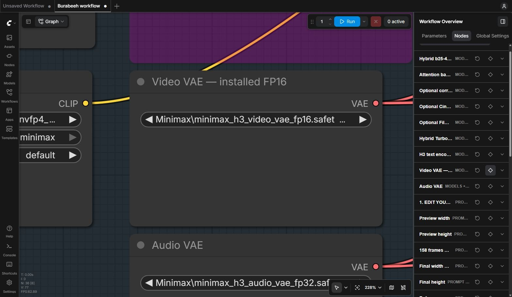

[Back to node index](#node-index)

### 9. Audio VAE

**Type:** `VAELoader`. **Mode:** active.

Loads the H3 audio VAE in FP32. This handles the sound representation. It is separate from the video VAE and is required for native speech and ambience. Do not substitute an LTX audio VAE.

**Connections and saved settings**

| Item | Value or source |
|---|---|
| Setting `vae_name` | `Minimax\minimax_h3_audio_vae_fp32.safetensors` |

**Feeds:** **20** (MiniMaxH3ReferenceToVideo), **28** (VAEDecodeAudio).

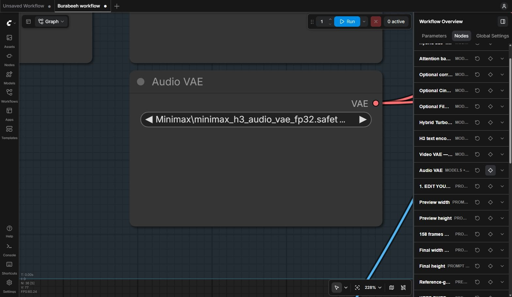

[Back to node index](#node-index)

### 10. 1. EDIT YOUR PROMPT

**Type:** `PrimitiveStringMultiline`. **Mode:** active.

Write the shot here. Describe the person, correct location, one bounded action, camera, light and style under integrated multimodal description. Under overall soundscape specify exact short dialogue and ambience. A connected prompt overrides the duplicate text shown inside the conditioning node.

**Feeds:** **20** (MiniMaxH3ReferenceToVideo).

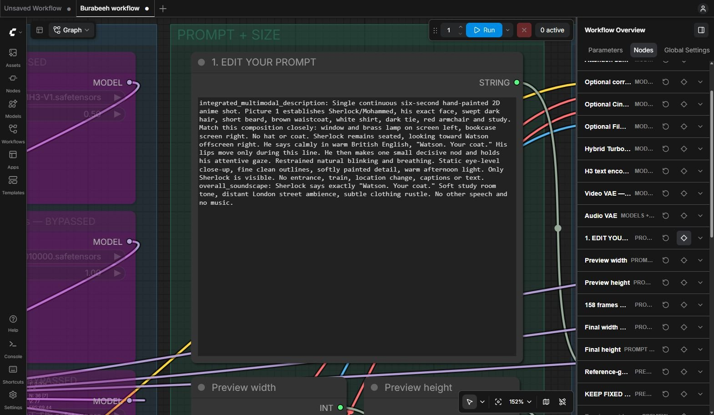

[Back to node index](#node-index)

### 11. Preview width

**Type:** `PrimitiveInt`. **Mode:** active.

Preview width is 864 pixels. Width and height control the first sampling stage. Start at this tested size on the 24 gigabyte GPU; raising resolution increases memory and runtime. Change width and height together to maintain the intended composition.

**Connections and saved settings**

| Item | Value or source |
|---|---|
| Setting `value` | `864` |

**Feeds:** **20** (MiniMaxH3ReferenceToVideo).

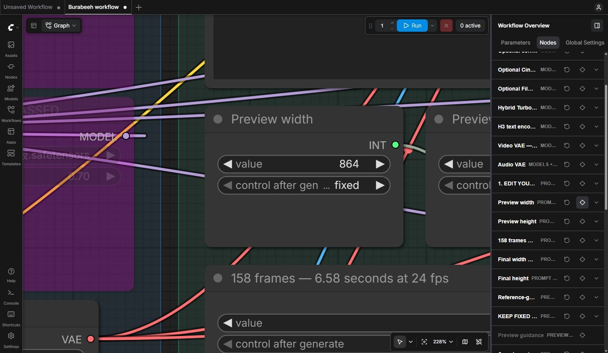

[Back to node index](#node-index)

### 12. Preview height

**Type:** `PrimitiveInt`. **Mode:** active.

Preview height is 480 pixels. The preview is a slightly wider than sixteen by nine working frame. The final dimensions differ slightly in aspect ratio, so inspect framing after refinement rather than assuming an identical crop.

**Connections and saved settings**

| Item | Value or source |
|---|---|
| Setting `value` | `480` |

**Feeds:** **20** (MiniMaxH3ReferenceToVideo).

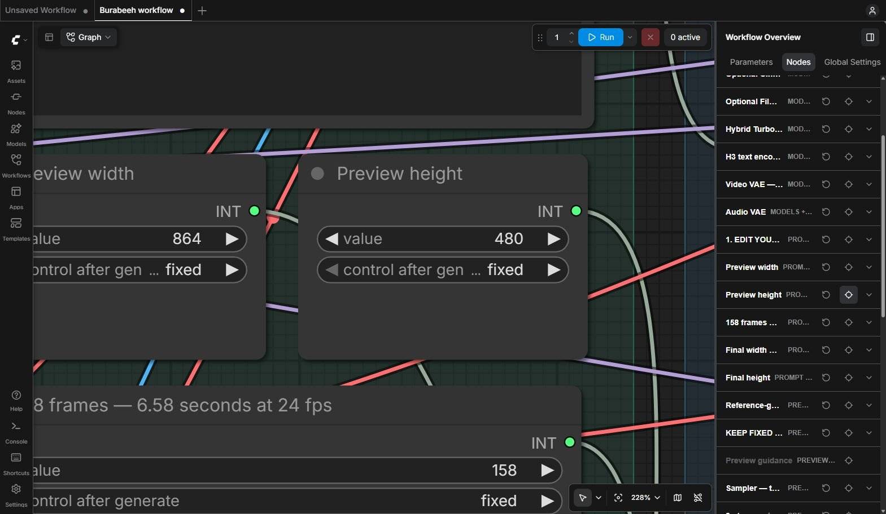

[Back to node index](#node-index)

### 13. 158 frames — 6.58 seconds at 24 fps

**Type:** `PrimitiveInt`. **Mode:** active.

The clip contains 158 frames. At 24 frames per second this is about 6.58 seconds. Keep this tested length for your first run. Generated duration does not guarantee that a long spoken line will fit.

**Connections and saved settings**

| Item | Value or source |
|---|---|
| Setting `value` | `158` |

**Feeds:** **20** (MiniMaxH3ReferenceToVideo).

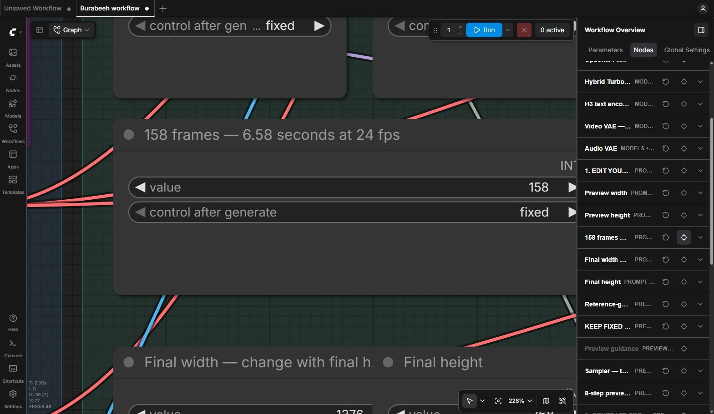

[Back to node index](#node-index)

### 14. Final width — change with final height

**Type:** `PrimitiveInt`. **Mode:** active.

Final width is 1376 pixels. This value feeds the latent upscaler. It does not change preview resolution. Refinement increases detail after the first generation; it cannot reliably repair a wrong face, location or action.

**Connections and saved settings**

| Item | Value or source |
|---|---|
| Setting `value` | `1376` |

**Feeds:** **40** (MinimaxH3LatentUpscaler3D).

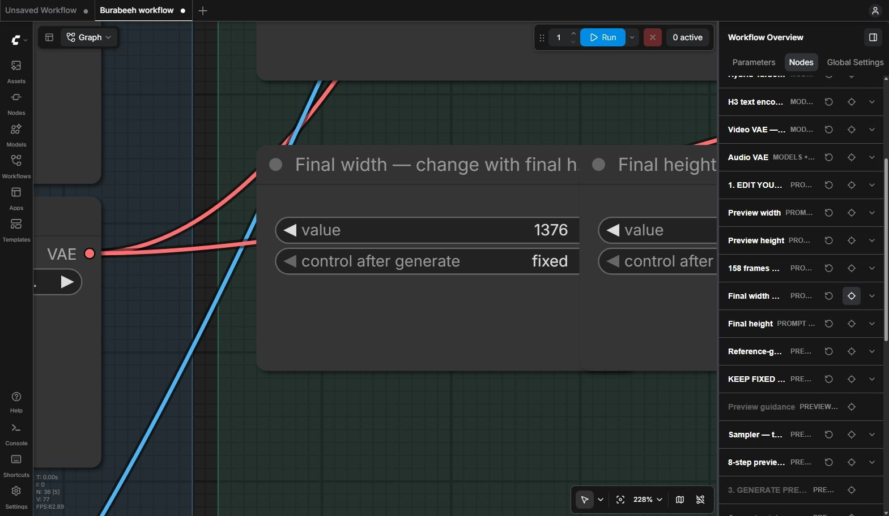

[Back to node index](#node-index)

### 15. Final height

**Type:** `PrimitiveInt`. **Mode:** active.

Final height is 768 pixels. Use it with final width 1376 for the tested refinement. Larger output dimensions can exceed available memory. Keep the initial settings until a complete preview and refinement have succeeded.

**Connections and saved settings**

| Item | Value or source |
|---|---|
| Setting `value` | `768` |

**Feeds:** **40** (MinimaxH3LatentUpscaler3D).

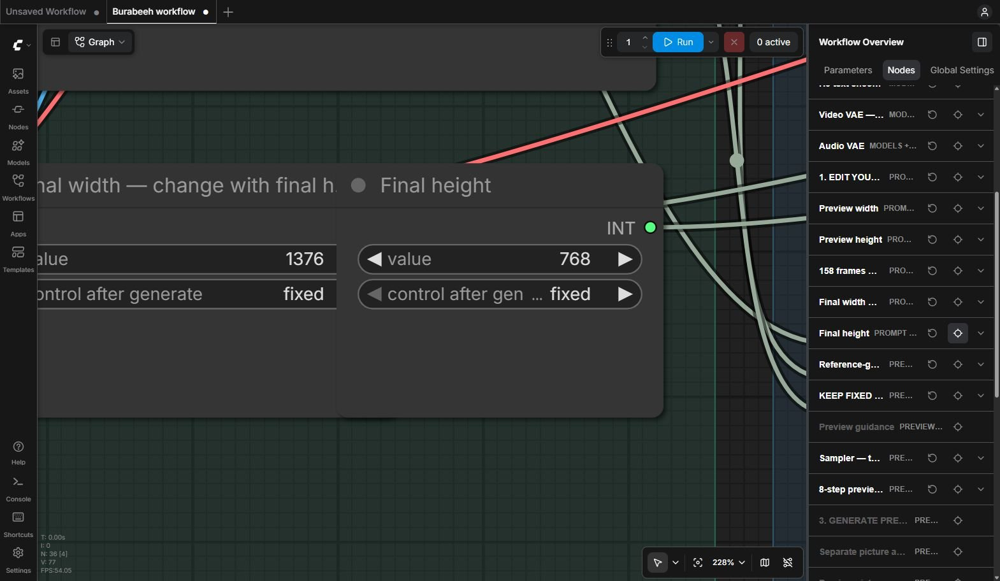

[Back to node index](#node-index)

### 20. Reference-guided H3 — Episode 1 image CONNECTED

**Type:** `MiniMaxH3ReferenceToVideo`. **Mode:** active.

Reference-to-video conditioning combines the prompt, image reference, both VAEs, dimensions and frame count. Reference image zero is connected. The output provides positive conditioning and the starting audio-video latent. A reference can influence the entire background, not just a face.

**Connections and saved settings**

| Item | Value or source |
|---|---|
| Input `clip` | Node **7**, `CLIP` output |
| Input `vae` | Node **8**, `VAE` output |
| Input `audio_vae` | Node **9**, `VAE` output |
| Input `ref_images.ref_image_0` | Node **100**, `IMAGE` output |
| Input `prompt` | Node **10**, `STRING` output |
| Input `width` | Node **11**, `INT` output |
| Input `height` | Node **12**, `INT` output |
| Input `length` | Node **13**, `INT` output |
| Setting `ref_image_size` | `match` |

**Feeds:** **22** (BasicGuider), **25** (SamplerCustomAdvanced), **42** (BasicGuider).

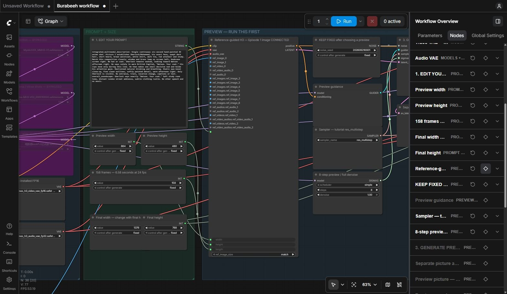

[Back to node index](#node-index)

### 21. KEEP FIXED after choosing a preview

**Type:** `RandomNoise`. **Mode:** active.

The random seed is fixed. Keeping the seed, prompt, references and model settings unchanged makes comparisons more controlled. Changing the seed selects a different starting noise pattern. Lock it after selecting a useful preview.

**Connections and saved settings**

| Item | Value or source |
|---|---|
| Setting `noise_seed` | `202609210001` |

**Feeds:** **25** (SamplerCustomAdvanced), **44** (SamplerCustomAdvanced).

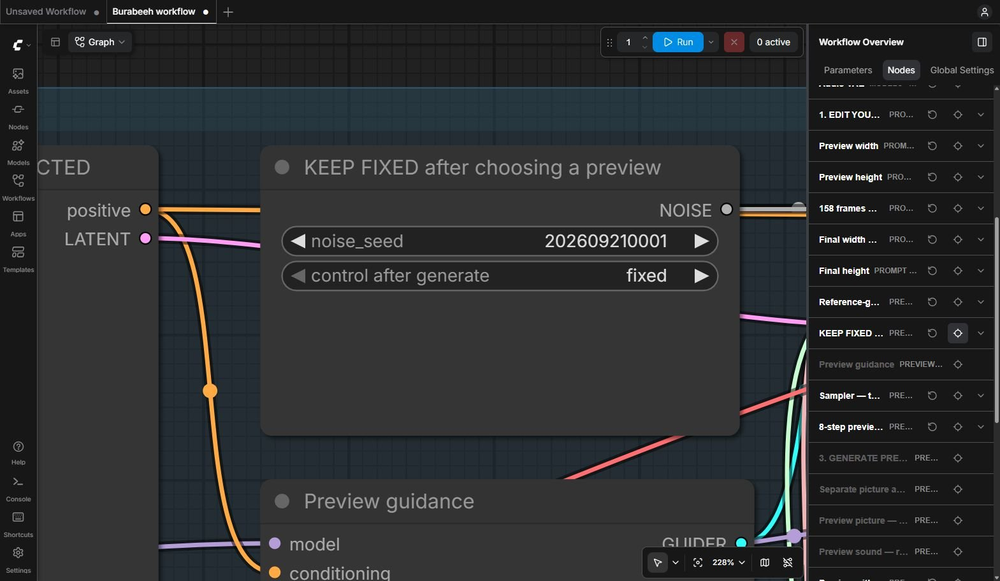

[Back to node index](#node-index)

### 22. Preview guidance

**Type:** `BasicGuider`. **Mode:** active.

Basic guidance combines the model and positive conditioning for preview sampling. It has no editable guidance slider in this graph. A disabled-looking properties row can simply mean there are no editable widgets; it does not mean the graph node is muted.

**Connections and saved settings**

| Item | Value or source |
|---|---|
| Input `model` | Node **6**, `MODEL` output |
| Input `conditioning` | Node **20**, `positive` output |

**Feeds:** **25** (SamplerCustomAdvanced).

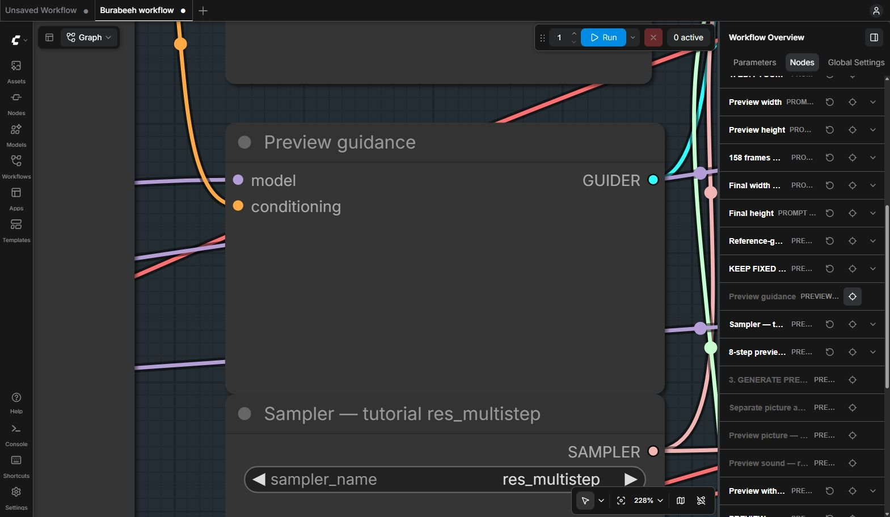

[Back to node index](#node-index)

### 23. Sampler — tutorial res_multistep

**Type:** `KSamplerSelect`. **Mode:** active.

Selects the res multistep sampler. The preview and refinement share this sampler. Keep the tested sampler when checking reproducibility. Changing it changes the sampling process and requires a fresh quality check.

**Connections and saved settings**

| Item | Value or source |
|---|---|
| Setting `sampler_name` | `res_multistep` |

**Feeds:** **25** (SamplerCustomAdvanced), **44** (SamplerCustomAdvanced).

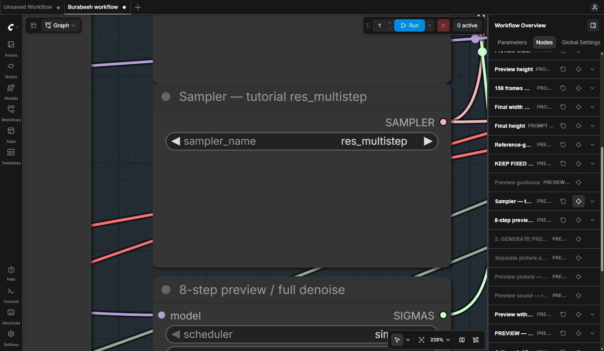

[Back to node index](#node-index)

### 24. 8-step preview / full denoise

**Type:** `BasicScheduler`. **Mode:** active.

The preview scheduler uses simple scheduling, eight steps and full denoise of one. It builds the noise schedule for the first generation. The compatible Turbo adapter makes this short schedule practical in the tested configuration.

**Connections and saved settings**

| Item | Value or source |
|---|---|
| Input `model` | Node **6**, `MODEL` output |
| Setting `scheduler` | `simple` |
| Setting `steps` | `8` |
| Setting `denoise` | `1.0` |

**Feeds:** **25** (SamplerCustomAdvanced).

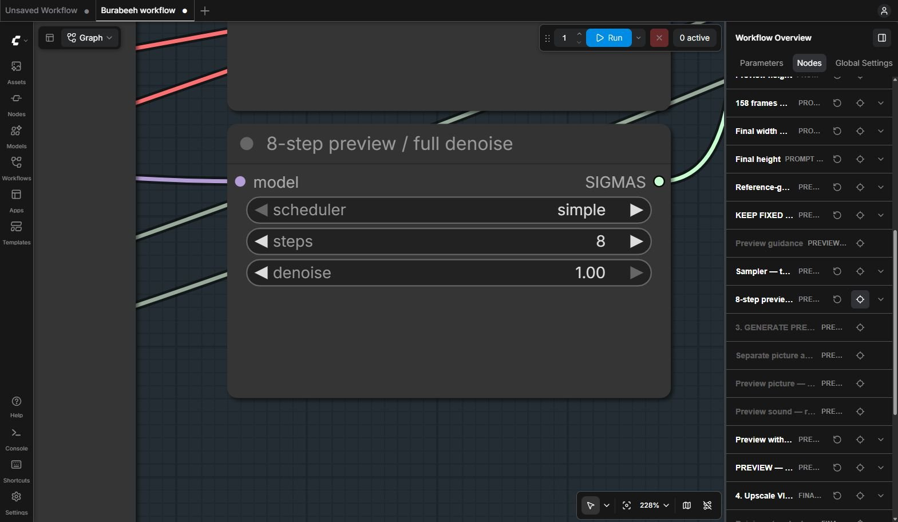

[Back to node index](#node-index)

### 25. 3. GENERATE PREVIEW

**Type:** `SamplerCustomAdvanced`. **Mode:** active.

The advanced sampler creates the preview audio-video latent from noise, guidance, sampler, schedule and initial latent. This is the expensive first sampling stage. Watch progress and errors in the job queue; do not submit duplicate jobs while one is running.

**Connections and saved settings**

| Item | Value or source |
|---|---|
| Input `noise` | Node **21**, `NOISE` output |
| Input `guider` | Node **22**, `GUIDER` output |
| Input `sampler` | Node **23**, `SAMPLER` output |
| Input `sigmas` | Node **24**, `SIGMAS` output |
| Input `latent_image` | Node **20**, `LATENT` output |

**Feeds:** **26** (LTXVSeparateAVLatent).

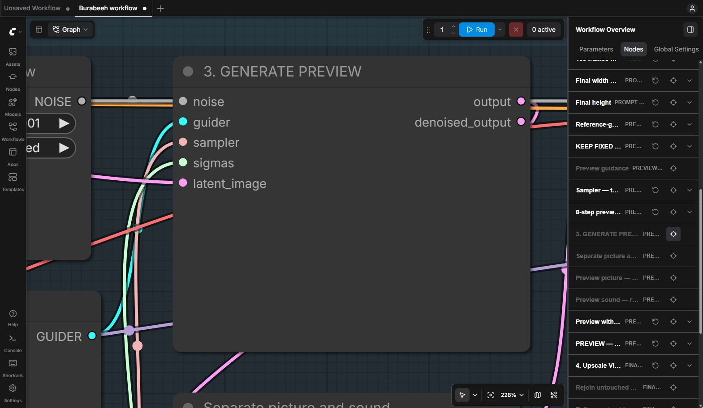

[Back to node index](#node-index)

### 26. Separate picture and sound

**Type:** `LTXVSeparateAVLatent`. **Mode:** active.

Separates the generated audio-video latent into picture and sound branches. Despite the LTX name, this utility is used here for the compatible combined latent structure. It does not load an LTX diffusion model.

**Connections and saved settings**

| Item | Value or source |
|---|---|
| Input `av_latent` | Node **25**, `output` output |

**Feeds:** **27** (VAEDecodeTiled), **28** (VAEDecodeAudio), **40** (MinimaxH3LatentUpscaler3D), **41** (LTXVConcatAVLatent).

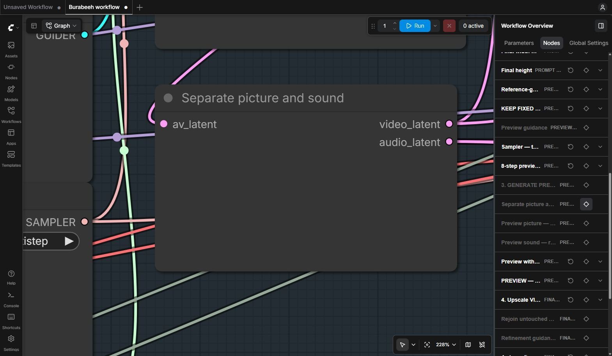

[Back to node index](#node-index)

### 27. Preview picture — tiled decode

**Type:** `VAEDecodeTiled`. **Mode:** active.

Tiled video decoding turns the preview visual latent into frames while limiting decoding memory. The tested settings are tile size 512, overlap 64, temporal size 32 and temporal overlap eight. Keep them for the first test.

**Connections and saved settings**

| Item | Value or source |
|---|---|
| Input `samples` | Node **26**, `video_latent` output |
| Input `vae` | Node **8**, `VAE` output |
| Setting `tile_size` | `512` |
| Setting `overlap` | `64` |
| Setting `temporal_size` | `32` |
| Setting `temporal_overlap` | `8` |

**Feeds:** **29** (CreateVideo).

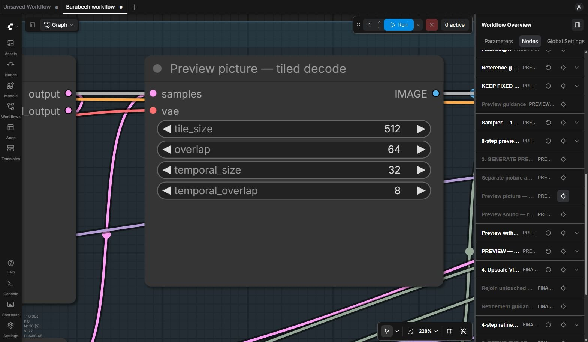

[Back to node index](#node-index)

### 28. Preview sound — reused for final output

**Type:** `VAEDecodeAudio`. **Mode:** active.

Decodes the preview audio latent into a waveform with the H3 audio VAE. The final output deliberately reuses this stage-one audio. Listen for missing words, repeated dialogue, cut-off endings and unwanted extra voices.

**Connections and saved settings**

| Item | Value or source |
|---|---|
| Input `samples` | Node **26**, `audio_latent` output |
| Input `vae` | Node **9**, `VAE` output |

**Feeds:** **29** (CreateVideo), **47** (CreateVideo).

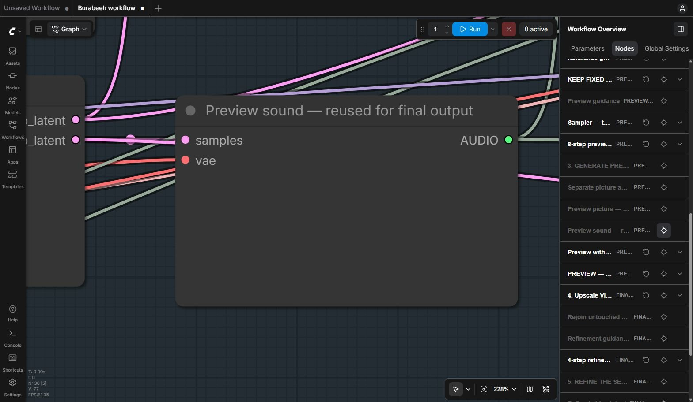

[Back to node index](#node-index)

### 29. Preview with original audio

**Type:** `CreateVideo`. **Mode:** active.

Combines the decoded preview frames and sound at 24 frames per second. Keep the frame rate consistent with the intended duration. This creates a video object; the following Save Video node writes the actual file.

**Connections and saved settings**

| Item | Value or source |
|---|---|
| Input `images` | Node **27**, `IMAGE` output |
| Input `audio` | Node **28**, `AUDIO` output |
| Setting `fps` | `24.0` |
| Setting `bit_depth` | `auto` |
| Setting `color_space` | `sRGB` |

**Feeds:** **30** (SaveVideo).

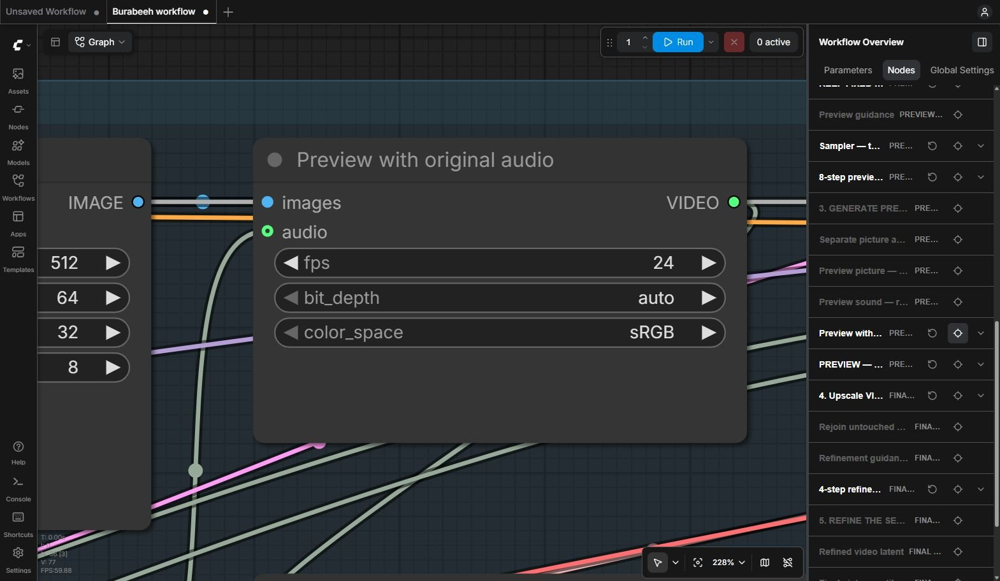

[Back to node index](#node-index)

### 30. PREVIEW — review motion + sound first

**Type:** `SaveVideo`. **Mode:** active.

Saves the preview with the Burabeeh workflow preview prefix. Review the entire clip with sound before accepting it. Check character identity, room, hands, props and motion. A playable file or matching transcription alone is not full quality approval.

**Connections and saved settings**

| Item | Value or source |
|---|---|
| Input `video` | Node **29**, `VIDEO` output |
| Setting `filename_prefix` | `Burabeeh-workflow/preview` |
| Setting `format` | `auto` |
| Setting `format.codec` | `auto` |
| Setting `codec` | `auto` |

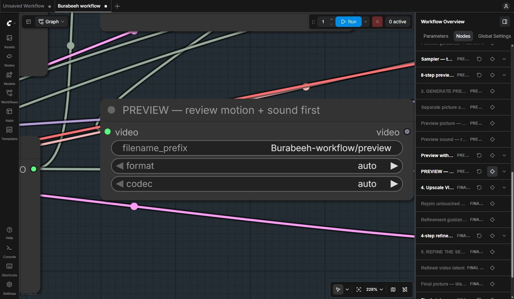

[Back to node index](#node-index)

### 40. 4. Upscale VIDEO latent only

**Type:** `MinimaxH3LatentUpscaler3D`. **Mode:** active.

Upscales only the visual latent using the dedicated H3 three-dimensional latent upscaler. The target is 1376 by 768, with temporal chunk 32, CUDA and BF16. The audio branch is kept separate so picture enhancement does not replace the preview dialogue.

**Connections and saved settings**

| Item | Value or source |
|---|---|
| Input `latent` | Node **26**, `video_latent` output |
| Input `mode.width` | Node **14**, `INT` output |
| Input `mode.height` | Node **15**, `INT` output |
| Setting `model_name` | `minimax_h3_latent_upscaler_3d_bf16.safetensors` |
| Setting `mode` | `target dimensions` |
| Setting `align` | `32` |
| Setting `enable_temporal_chunking` | `True` |
| Setting `force_unload` | `True` |
| Setting `device` | `cuda` |
| Setting `precision` | `bf16` |

**Feeds:** **41** (LTXVConcatAVLatent).

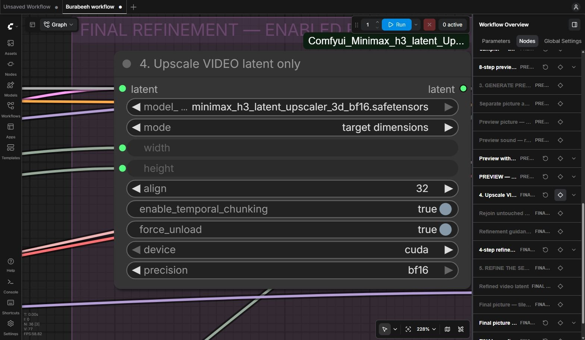

[Back to node index](#node-index)

### 41. Rejoin untouched audio latent

**Type:** `LTXVConcatAVLatent`. **Mode:** active.

Recombines the enlarged visual latent and original audio latent before refinement. The name is another audio-video utility, not an LTX model dependency. Keep the two branches connected in the supplied order.

**Connections and saved settings**

| Item | Value or source |
|---|---|
| Input `video_latent` | Node **40**, `latent` output |
| Input `audio_latent` | Node **26**, `audio_latent` output |

**Feeds:** **44** (SamplerCustomAdvanced).

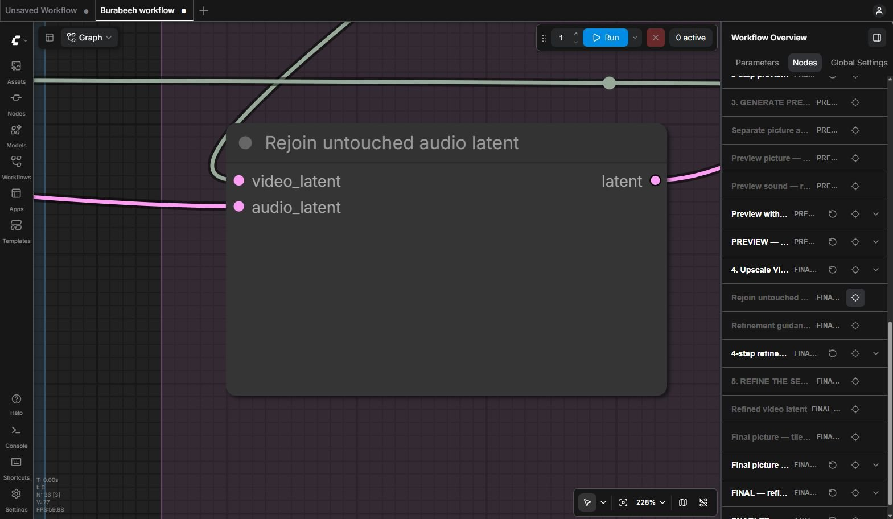

[Back to node index](#node-index)

### 42. Refinement guidance — same prompt/references

**Type:** `BasicGuider`. **Mode:** active.

Creates refinement guidance from the same model and positive conditioning. The prompt and references must stay consistent with the selected preview. Changing the story between stages defeats the purpose of refining a selected take.

**Connections and saved settings**

| Item | Value or source |
|---|---|
| Input `model` | Node **6**, `MODEL` output |
| Input `conditioning` | Node **20**, `positive` output |

**Feeds:** **44** (SamplerCustomAdvanced).

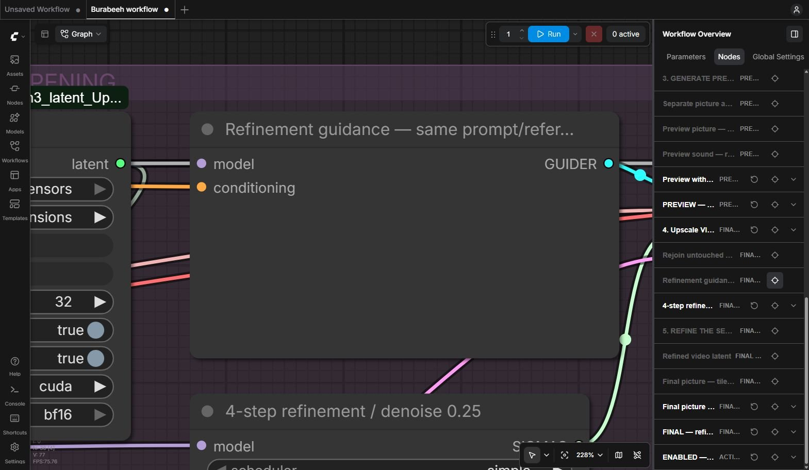

[Back to node index](#node-index)

### 43. 4-step refinement / denoise 0.25

**Type:** `BasicScheduler`. **Mode:** active.

The refinement schedule uses simple scheduling, four steps and denoise zero point two five. It makes a smaller change than full-denoise generation. Raising denoise can change identity, composition and action, so treat changes as new experiments.

**Connections and saved settings**

| Item | Value or source |
|---|---|
| Input `model` | Node **6**, `MODEL` output |
| Setting `scheduler` | `simple` |
| Setting `steps` | `4` |
| Setting `denoise` | `0.25` |

**Feeds:** **44** (SamplerCustomAdvanced).

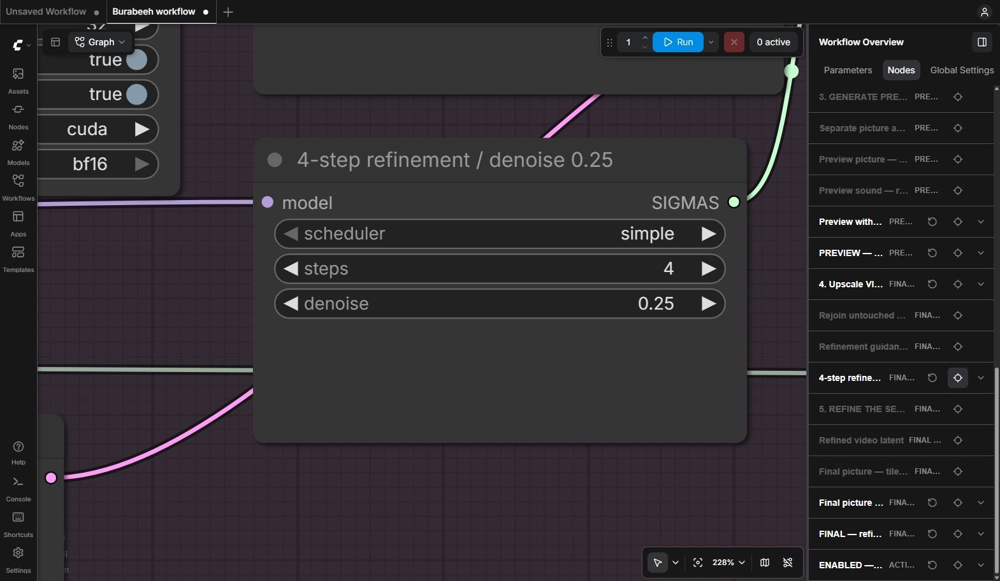

[Back to node index](#node-index)

### 44. 5. REFINE THE SELECTED PREVIEW

**Type:** `SamplerCustomAdvanced`. **Mode:** active.

Runs the second advanced sampler on the enlarged combined latent. It uses the fixed noise source, refinement guidance, shared sampler and four-step schedule. This stage is a real generation pass, not ordinary image resizing.

**Connections and saved settings**

| Item | Value or source |
|---|---|
| Input `noise` | Node **21**, `NOISE` output |
| Input `guider` | Node **42**, `GUIDER` output |
| Input `sampler` | Node **23**, `SAMPLER` output |
| Input `sigmas` | Node **43**, `SIGMAS` output |
| Input `latent_image` | Node **41**, `latent` output |

**Feeds:** **45** (LTXVSeparateAVLatent).

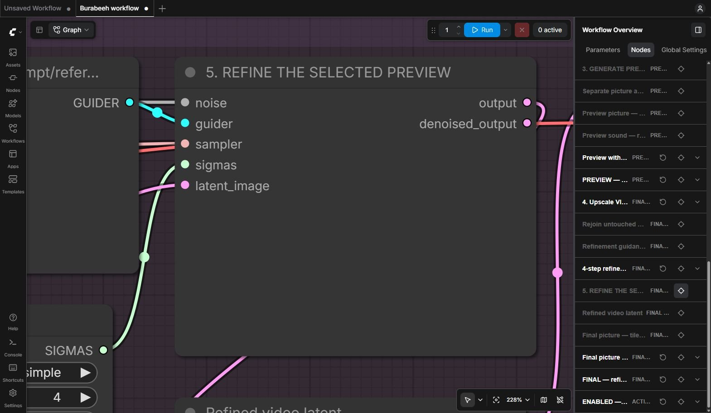

[Back to node index](#node-index)

### 45. Refined video latent

**Type:** `LTXVSeparateAVLatent`. **Mode:** active.

Separates the refined combined latent again. Only its visual result is used for final picture decoding. The final video uses audio decoded from the first stage, which is why the connection from node 28 must remain intact.

**Connections and saved settings**

| Item | Value or source |
|---|---|
| Input `av_latent` | Node **44**, `output` output |

**Feeds:** **46** (VAEDecodeTiled).

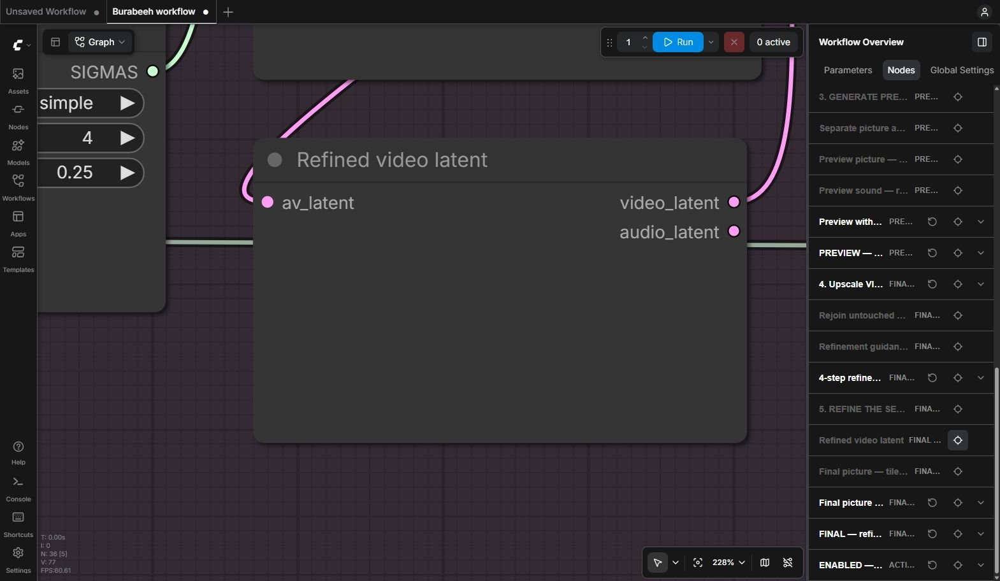

[Back to node index](#node-index)

### 46. Final picture — tiled decode

**Type:** `VAEDecodeTiled`. **Mode:** active.

Decodes the refined visual latent into the final frames with the video VAE. It uses the same tested tiled decoding settings. If decoding runs out of memory, first return to the tested resolution and close competing GPU jobs.

**Connections and saved settings**

| Item | Value or source |
|---|---|
| Input `samples` | Node **45**, `video_latent` output |
| Input `vae` | Node **8**, `VAE` output |
| Setting `tile_size` | `512` |
| Setting `overlap` | `64` |
| Setting `temporal_size` | `32` |
| Setting `temporal_overlap` | `8` |

**Feeds:** **47** (CreateVideo).

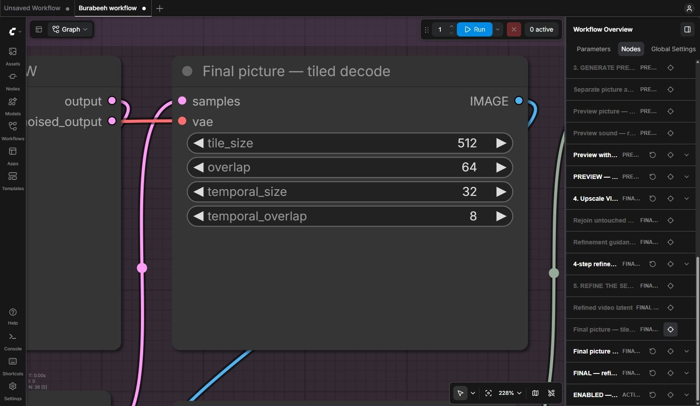

[Back to node index](#node-index)

### 47. Final picture + stage-one audio

**Type:** `CreateVideo`. **Mode:** active.

Combines final frames with the original stage-one audio at 24 frames per second. This is the important sound-preservation connection: enhanced picture from node 46, original decoded sound from node 28.

**Connections and saved settings**

| Item | Value or source |
|---|---|
| Input `images` | Node **46**, `IMAGE` output |
| Input `audio` | Node **28**, `AUDIO` output |
| Setting `fps` | `24` |
| Setting `bit_depth` | `auto` |
| Setting `color_space` | `sRGB` |

**Feeds:** **48** (SaveVideo).

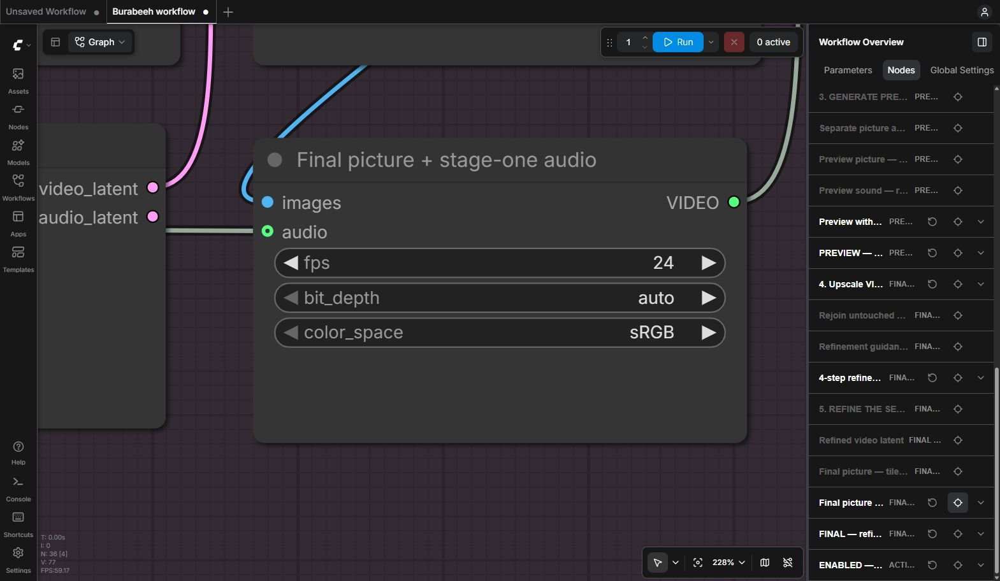

[Back to node index](#node-index)

### 48. FINAL — refinement output (enabled)

**Type:** `SaveVideo`. **Mode:** active.

Saves the refined video with the Burabeeh workflow refined prefix. This output is enabled in the supplied workflow. Run therefore generates both stages unless you mute this output first. The old disabled label was misleading and has been corrected.

**Connections and saved settings**

| Item | Value or source |
|---|---|
| Input `video` | Node **47**, `VIDEO` output |
| Setting `filename_prefix` | `Burabeeh-workflow/refined` |
| Setting `format` | `auto` |
| Setting `format.codec` | `auto` |

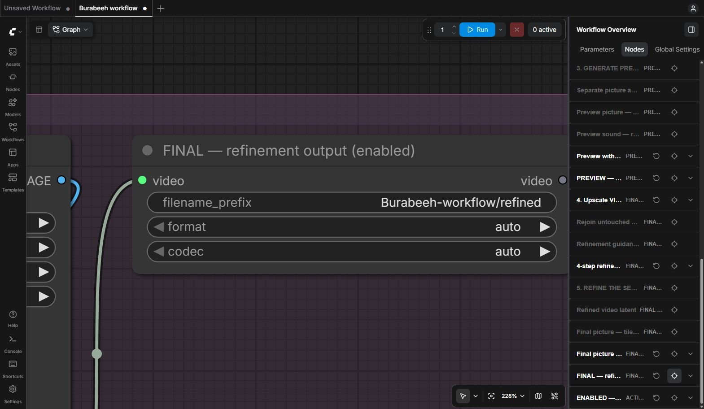

[Back to node index](#node-index)

### 100. ENABLED — Sherlock identity + Episode 1 end frame

**Type:** `LoadImage`. **Mode:** active.

Load the reference image here and keep its image output connected to reference image zero. Use a reference that already matches the intended location. A portrait taken in another room can pull that room into the result. For a new scene, use a coherent character-and-location reference.

**Connections and saved settings**

| Item | Value or source |
|---|---|
| Setting `image` | `ep01_end_frame.png` |

**Feeds:** **20** (MiniMaxH3ReferenceToVideo).

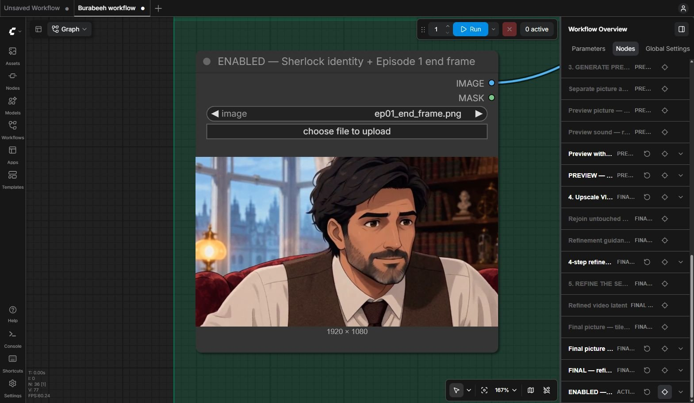

[Back to node index](#node-index)

## Troubleshooting and review

- **Missing model:** compare the exact folder and filename to the model manifest. The three bypassed adapter placeholders do not need files.
- **Turbo shape mismatch:** the unadapted source adapter is not a replacement for the curve-compatible file. See the reproduction caveat in MODEL-NOTES.md.
- **Missing image:** upload a reference through node 100 and choose it in the node. Merely copying a file while the browser is open may leave its dropdown stale.
- **Wrong room or face:** repair the reference before spending another refinement pass. Separate unrelated location cues; one coherent character-in-location still worked better for the corrected crime-scene takes.
- **Repeated or missing dialogue:** shorten the line, render a new take, and listen. Automatic transcription can help but cannot verify voice quality.
- **Out of memory:** use the tested dimensions, one GPU job at a time, and tiled decode. Avoid simultaneous workloads on another ComfyUI server.
- **No speedup on refinement:** input changes or restarting the server can invalidate upstream cache. There is no permanent saved-latent loader in this graph.
- **Muted versus no widgets:** a grey properties row with no editable parameters does not prove the underlying graph node is muted. Inspect node mode.

## What was actually verified

This workflow family previously completed local preview and refinement jobs on an RTX 3090 24 GB. The user accepted the opening preview. Later episode takes exposed location and dialogue problems; successful execution is not artistic approval. The tutorial captures actual node screens. It does not present bypassed adapters as executed or claim every generated take is usable. The original episode videos were subsequently selected for deletion.

## Backup scope

The backup contains the graph, reference/API instructions, complete node documentation, captured node screens and the narrated tutorial. It excludes model weights, credentials, personal reference image files and historical episode footage. Downloaded model licenses continue to apply.

See [the exact connection map](CONNECTIONS.md) for every linked input.

## Recorded run demonstration

The accompanying screen walkthrough shows node 48 being muted, the preview being queued, the active sampler, preview completion, node 48 being re-enabled, and refinement using the cached preview. The first fresh preview took 404.72 seconds after memory cleanup. This is one measured run, not a general speed promise.

## Screen-by-screen run demonstration

### Run step 1 — mute the final output

Here is the real preview-only switch. Click the title of node 48 to select it, then press Control M. The node becomes translucent. Its title is just a label, so the word enabled does not update automatically. The actual mute state determines whether final saving runs.

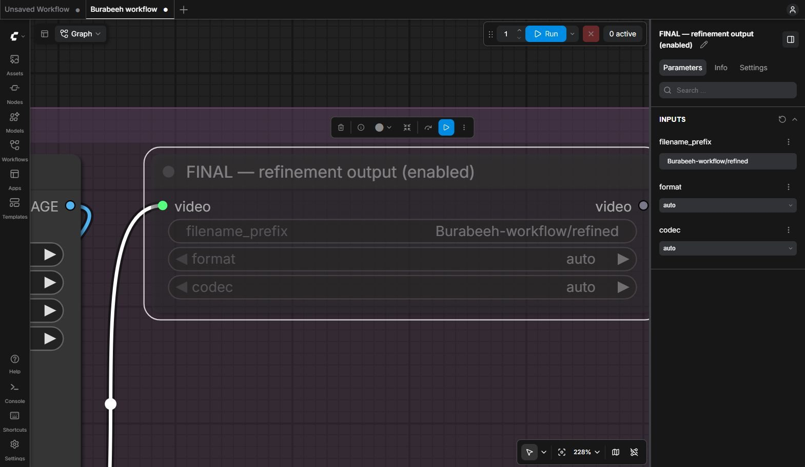

### Run step 2 — submit one preview

Click the blue Run button once. ComfyUI queues the preview and loads the required models. The final output was muted for this run. After clearing the memory cache, model initialization can take substantially longer than a warm run. Do not click Run repeatedly.

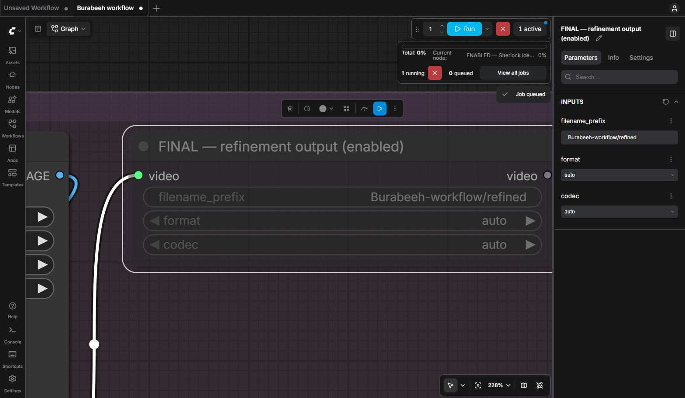

### Run step 3 — watch the job queue

Open the active job counter to watch progress. The current node and progress percentage appear at the top. Older entries may refer to deleted files and show unavailable media. That does not mean the current job failed. Wait for the current job to complete before deciding what to do next.

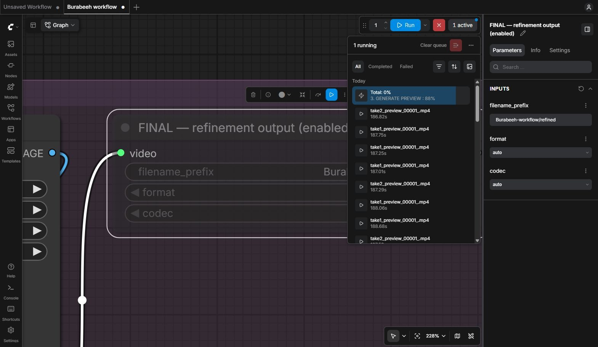

### Run step 4 — preview complete

The preview has now finished successfully. This cold-cache demonstration took about 405 seconds on the local RTX 3090. The output contains 158 frames at 864 by 480 with audio. Completion verifies execution; you still need to play and review the scene before accepting it for a film.

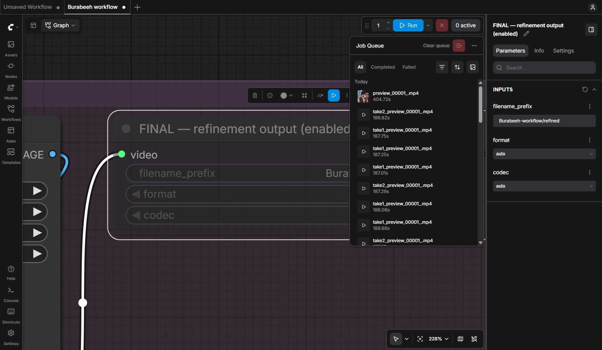

### Run step 5 — enable refinement

Select node 48 again and press Control M to unmute it. Keep the seed, prompt, reference, dimensions and model settings unchanged. The supplied workflow has both outputs enabled by default. This manual mute and unmute sequence creates a deliberate review step.

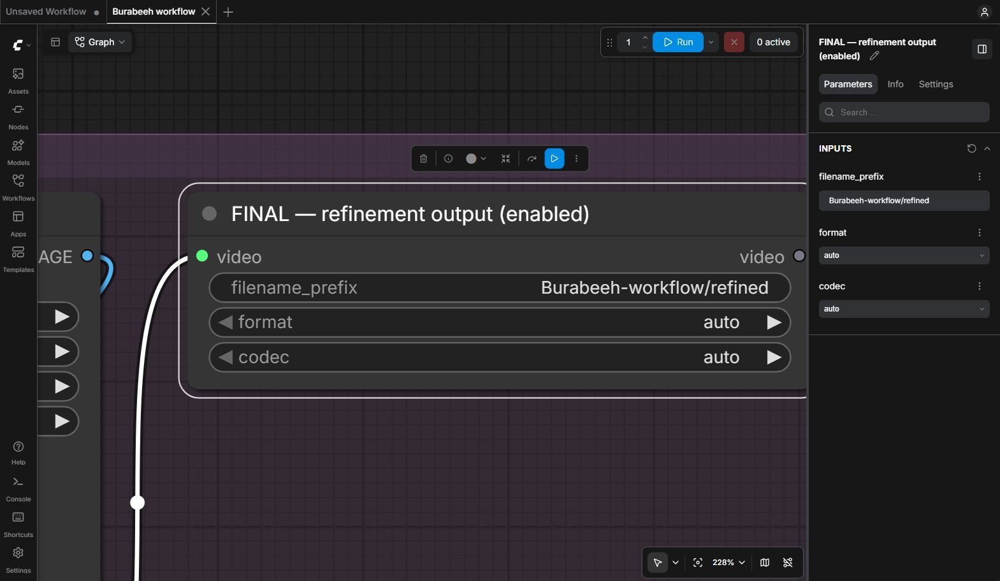

### Run step 6 — reuse the preview

Click Run again. In this demonstration, the job jumps directly to the latent upscaler because the preview is still cached. It then runs the four-step refinement and final decoding. This is conditional caching, not a saved preview file being loaded back into the model.

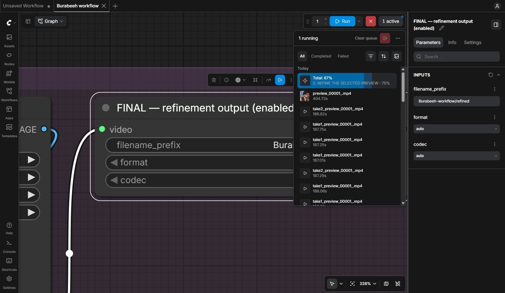

### Run step 7 — final output verified

Refinement has completed successfully. The final file has 158 frames at 1376 by 768. This pass took about 271 seconds. Both files decoded correctly, and their decoded audio samples were identical. These checks prove execution and sound preservation, while identity, motion and delivery still require a viewing and listening review.

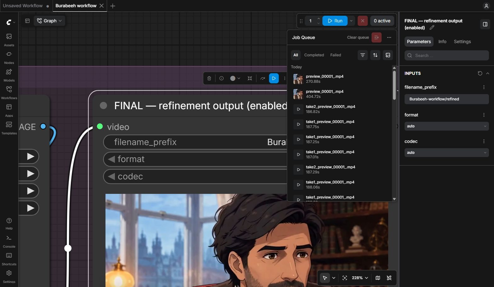

## Downloads and backup

- [Workflow JSON](Burabeeh%20workflow.json?raw=true) — open this in ComfyUI.
- [Preview API graph](Burabeeh-preview.api.json) and [full API graph](Burabeeh-full.api.json) — for API integrations, not the normal canvas import.
- [Workflow and illustrated documentation ZIP](Burabeeh-workflow-backup.zip?raw=true).
- [Offline illustrated HTML tutorial](Burabeeh-workflow-tutorial.html?raw=true) — download, then open locally.
- [Narrated video](Burabeeh-workflow-tutorial.mp4?raw=true), [chapter list](VIDEO-CHAPTERS.md), [full connection map](CONNECTIONS.md).
- [Validation record](VALIDATION.json), [model manifest](MODEL-MANIFEST.json), [environment](ENVIRONMENT.json).

The public ZIP contains the workflow and illustrated documentation; the video and standalone HTML are separate downloads. The complete local archive includes both. This is a workflow backup, not an offline backup of all model weights.

## Credits

Built on ComfyUI, MiniMax H3, the LBH H3 latent upscaler, the TenStrip Turbo adapter and the compatibility helper identified in [MODEL-NOTES.md](MODEL-NOTES.md). Workflow direction was based on [the supplied video](https://youtu.be/tmw2QOFaaPI). Burabeeh names this configured workflow and tutorial package; upstream projects and weights retain their own ownership and licenses.
